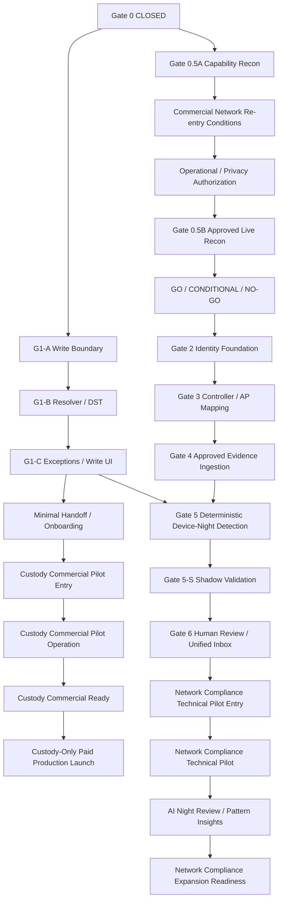

# Boarding Device Manager — Implementation Baseline v2.6
## Custody-First Commercial Track Controlled Amendment

**Status:** IMPLEMENTATION BASELINE v2.6 — LOCKED CONTROLLED AMENDMENT  
**Base document amended:** `docs/device-manager/implementation-baseline-v2.md`  
**Base version:** Implementation Baseline v2  
**Base reference:** `bb5e9f0e6f522a8a3f364b2cd913e525fce3e683`  
**Amendment version:** **v2.6**  
**Decision date:** 2026-09-10 (America/New_York)  
**Companion commercial baseline:** `Commercial Strategy Baseline v1.7`

**Purpose:** create a separate custody-first commercial path while preserving the existing Network Compliance architecture, privacy controls, Shadow requirements, human-review requirements, and AI safety boundaries.

This is a controlled amendment. It does not silently reinterpret the base document and it does not reopen completed gates.

---

## 1. Source-of-Truth Precedence — D01 Amendment

**AMENDED — D01**

After this v2.6 amendment is locked, architecture/spec precedence is:

1. **A later locked controlled revision**, for every item that later revision explicitly maps as AMENDED or CLARIFIED
2. **Implementation Baseline v2.6 controlled amendment**, for every item explicitly mapped as AMENDED or CLARIFIED here
3. **Implementation Baseline v2**, for all other architecture/spec content
4. `gates.md` and the actual repository source for implementation/closure evidence

Commercial Strategy Baseline v1.7 governs only the matters this v2.6 amendment explicitly delegates to it, including:

- QPCP commercial counting
- C18 commercial GO / CONDITIONAL / INCONCLUSIVE / NO-GO classification
- Network commercial re-entry conditions
- O-C01 founder/employer/contracting gate
- O-C02 custody pilot identification/first-capture validation
- O-C04 external-school privacy/legal applicability gate
- C20 live custody-pilot concurrency limit

Where both the Implementation Baseline and Commercial Strategy constrain the same transition, **all applicable conditions must be satisfied; neither document relaxes the other.**

A chat instruction or review comment does not silently overwrite a locked baseline. A future change to a DECIDED architecture item requires a later locked controlled documentation revision.

Implementation evidence remains separate from architecture intent:

- this amendment cannot retroactively mark an unimplemented feature as implemented
- it cannot reopen or invalidate a previously CLOSED gate unless an explicit later gate action does so
- `gates.md` and repository evidence remain the authority for what actually passed, shipped, or was applied

## 2. Amendment Scope Classification

### 2.1 UNCHANGED

The following base decisions remain unchanged in substance:

- D02 decision discipline
- D03 Network Evidence ≠ Custody
- D04 Schedule ≠ Custody
- D05 Detection ≠ Incident
- D06 AI ≠ Authoritative Fact
- D07 Wi-Fi Presence ≠ Device Usage
- D08 Custody-storage AP presence ≠ physical custody proof
- D09 no browsing-history/site/content collection
- D10 tenant scope / least privilege / authorization / provenance / versioning
- D12 G1-A authoritative schedule write boundary
- D13 deterministic resolver
- D14 conservative DST policy
- D15 allow-only exception / schedule authoring contract
- D16–D27 Network evidence, location, identity, clock/coverage, evaluator, dedupe, Shadow, privacy/authorization, retention, and human-review contracts

Existing custody atomicity, stale/duplicate protection, audit, RLS, and role boundaries are unchanged.

### 2.2 CLARIFIED

- All generic `pilot` references inside Network-specific base sections mean the **Network Compliance Technical Pilot**, Network Shadow cohort, or its preparation unless this amendment explicitly says otherwise.
- A **Custody Commercial Pilot Operation** is a separate product stage and is not the commercial metric `Qualified Paid Custody Pilot (QPCP)`.
- Network NO-GO does not invalidate a custody-only product.
- Custody commercial success does not imply Network technical, privacy, or AI readiness.

### 2.3 AMENDED

The following base areas are amended:

- D01 source precedence
- §1 change-summary wording that implies one single pilot/pre-commercial path
- D11 dependency graph and related pilot/pre-commercial prose
- D28 Pilot / AI activation criteria
- O07 pilot OPEN scope
- O08 interpretation as AI-only
- §18 Pilot / AI activation criteria
- §19 scenario P02 owner label
- §20 old `Technical Pilot Entry`, `Actual Pilot`, `AI`, and `Pilot Completion / Pre-commercial` rows
- §21 self-review statements that describe one single pilot→AI→pre-commercial chain

The following Network-section terminology is **CLARIFIED, not technically relaxed**:

- §10 generic Network `pilot roster` / `pilot scope`
- §11 `Gate 6/Pilot`
- §12 `detection pilot`
- §14 Network `pilot` metrics / scope / AP inventory
- §15 `pilot stop` terminology

No D03–D27 invariant is weakened.

## 3. Exact Base-Term Occurrence Map

The following map is based on the base document at the recorded base reference. Every affected phrase must be verified again by an exact local text search before lock.

| Base v2 location / phrase | v2.6 classification | v2.6 meaning |
|---|---|---|
| §1 change table — `AI | Pilot 안정화 후, Pilot Completion / Pre-commercial 이전...` | AMENDED | Applies only to Network Compliance AI sequence. AI is not required for custody commercial pilot/launch. |
| §3 D11 graph — `Technical Pilot Entry` | AMENDED/RENAMED | `Network Compliance Technical Pilot Entry` |
| §3 D11 graph — `Actual Pilot` | AMENDED/RENAMED | `Network Compliance Technical Pilot` |
| §3 D11 graph — `Pilot Completion / Pre-commercial` | AMENDED/RENAMED | `Network Compliance Expansion Readiness` |
| §3 prose — `Gate 2의 pilot identity spec` | CLARIFIED | Network Compliance identity cohort/spec only |
| §3 prose — `Mode 제한은 Gate 5-S, Pilot, Pre-commercial 기록까지` | AMENDED/CLARIFIED | Network mode restriction persists through Network Compliance Technical Pilot and Network Compliance Expansion Readiness |
| §4 registry — `D28 | Pilot 및 AI activation/exit` | AMENDED | D28 becomes explicitly Network-track Pilot/AI criteria |
| §4 O07 — blocks `Technical Pilot Entry` | AMENDED/RENAMED | O07-N blocks Network Compliance Technical Pilot Entry only |
| §4 O08 — source includes `안정된 pilot evidence` | CLARIFIED | stable **Network Compliance Technical Pilot** evidence; O08 blocks AI only |
| §10 — `intended pilot student-device roster` | CLARIFIED | intended Network Compliance pilot roster |
| §10 — `pilot roster census` | CLARIFIED | Network Compliance pilot roster census |
| §10 — `unknown/network-level pilot` | CLARIFIED | Network Compliance unknown-only technical pilot mode |
| §10 — `미래 pilot scope` | CLARIFIED | future Network Compliance technical pilot scope |
| §11 — `Gate 6/Pilot도 학생/보호자 자동 발송...` | AMENDED/CLARIFIED | Gate 6 / Network Compliance Technical Pilot only |
| §12 — `해당 detection pilot의 Gate 5-S` | CLARIFIED | Network Compliance detection technical pilot |
| §14 — `pilot 전체와 각 residence` | CLARIFIED | Network Compliance Shadow/pilot cohort |
| §14 — `미래 pilot scope` | CLARIFIED | future Network Compliance technical pilot scope |
| §14 — `pilot AP inventory` | CLARIFIED | Network Compliance technical pilot AP inventory |
| §15 — `pilot stop 조건` | CLARIFIED | Network Compliance technical pilot stop condition |
| §18 heading — `Pilot / AI activation criteria` | AMENDED | Split into Custody Commercial Track and Network Compliance Pilot/AI |
| §18 — `Technical Pilot Entry` | AMENDED/RENAMED | Network Compliance Technical Pilot Entry |
| §18 — `Actual Pilot` / `actual-pilot overnight cycles` | AMENDED/RENAMED | Network Compliance Technical Pilot / its live cycles |
| §18 — `Pilot Completion / Pre-commercial` / `Pre-commercial` | AMENDED/RENAMED | Network Compliance Expansion Readiness |
| §18 — `Pilot evidence is untrusted data` | CLARIFIED | Network Compliance technical pilot evidence; same safety rule preserved |
| §19 P02 — Acceptance owner `Gate 4 / Gate 6 / Pilot` | AMENDED | `Gate 4 / Gate 6 / Network Compliance Technical Pilot` |
| §20 row — `Technical Pilot Entry` | AMENDED/RENAMED | Network Compliance Technical Pilot Entry |
| §20 row — `Actual Pilot` | AMENDED/RENAMED | Network Compliance Technical Pilot |
| §20 row — `AI Night Review + Pattern Insights` dependency on Actual Pilot | AMENDED but dependency preserved | remains Network-specific and still requires Gate 5-S + Gate 6 + stable Network technical pilot + O08 |
| §20 row — `Pilot Completion / Pre-commercial` | AMENDED/RENAMED | Network Compliance Expansion Readiness |
| §21 self-review — `AI가 pilot entry blocker는 아니지만 pre-commercial 이전 완료됨` | AMENDED | applies only to Network Compliance track; custody-only launch does not require AI |
| §21 implementation order — `...human incident→pilot→AI` | AMENDED/CLARIFIED | Network Compliance track only; custody commercial path exits separately after G1-C + handoff/onboarding |
| generic `Paid Production Launch` | SEARCH CONTROL | The pre-lock local search must record every literal match. Any match that implies Network is mandatory for custody-only launch must be amended. If zero matches exist, record `0 matches` in the lock evidence. |

### Mandatory pre-lock text search

The controlled lock evidence must show exact local search output for:

- `Technical Pilot Entry`
- `Actual Pilot`
- `Pilot Completion / Pre-commercial`
- `Pre-commercial`
- `Paid Production Launch`
- `pilot`
- `Pilot`
- `AI Night Review`

Every materially relevant occurrence must either appear in the table above or receive an explicit disposition before commit.

---

## 4. D11 Replacement — Two Independent Paths

**AMENDED — D11**

### D11 interpretation

- Custody Commercial Pilot Entry does not require Network 0.5B, Gate 2, Gate 3, Gate 4, Gate 5, Gate 5-S, Gate 6, or AI.
- Network Detection still requires G1-C plus the Network path.
- Existing Network GO/CONDITIONAL/NO-GO rules remain unchanged.
- A Network NO-GO does not invalidate a custody-only product.
- A custody commercial GO does not authorize Network monitoring.
- The existing AI Night Review is reachable only through the Network path shown above.

---

## 5. New Custody Commercial Decisions

### D31 — Custody Commercial Separation

**DECIDED — D31**

A custody-only product may be piloted and sold before Network functionality if the custody-specific entry/readiness gates pass.

### D32 — Custody Commercial Pilot Entry

**DECIDED — D32**

Requires:

- G1-B CLOSED
- G1-C CLOSED
- `Minimal Handoff / Onboarding` exit criteria PASS
- stable authorized custody transitions
- validated first-capture / identification workflow
- real collection-site connectivity check
- school-specific external-data privacy/legal entry complete
- operational and institutional/business approval
- founder/employer IP and contracting-entity gate resolved before a binding paid agreement
- support/rollback owner
- pilot scope and pre-agreed success criteria
- **Commercial Strategy C20 concurrency limit not exceeded**

No Network approval is required when no Network data is collected.

### D33 — Custody Commercial Pilot Operation

**DECIDED — D33**

`Custody Commercial Pilot Operation` is the technical/operational stage in which a real external school runs the custody-first product.

It is **not** itself the commercial metric QPCP.

Commercial Strategy Baseline v1.7 alone defines whether a given operation qualifies as a `Qualified Paid Custody Pilot (QPCP)`.

Purpose:

- validate nightly custody operation
- validate missing/unresolved/handoff workflow
- validate custody/dispute evidence
- validate onboarding/support load
- generate commercial conversion evidence

A live operation is also subject to Commercial Strategy C20's maximum-two concurrent-operation limit regardless of payment status.

### D34 — Custody Commercial Ready / Launch

**DECIDED — D34**

Custody Commercial Ready requires the exact §13 exit criteria, including:

- Commercial Strategy C18 = GO
- founder-time guardrails satisfied or verified remediation
- zero open critical custody/security defects
- custody-data deletion/offboarding rehearsal complete

A custody-only paid production edition may then launch without Network.

## 6. Commercial Claim Boundary

Before Network expansion is validated, custody-only claims may include:

- student/device custody
- Release / Return
- Missing / Recovery
- schedules
- allow-only exceptions
- unresolved / shift handoff
- custody history / accountability
- validated onboarding / first-capture

Do not claim:

- hidden-device detection
- Network compliance monitoring
- unknown-device attribution
- student-use inference from Wi-Fi
- Network-based incident detection
- AI compliance monitoring

---

## 7. Network Re-entry and Existing Gates

**DECIDED — D35**

Network architecture remains preserved but dormant until the Commercial Strategy v1.7 re-entry conditions are met.

After commercial re-entry, all existing Network-specific gates remain mandatory:

Operational / Privacy Authorization  
→ Gate 0.5B  
→ GO / CONDITIONAL / NO-GO  
→ Gate 2  
→ Gate 3  
→ Gate 4  
→ Gate 5  
→ Gate 5-S  
→ Gate 6  
→ Network Compliance Technical Pilot Entry  
→ Network Compliance Technical Pilot

No live student Network monitoring occurs before authorization.

---

## 8. D28 Replacement — Network Pilot and AI Only

**AMENDED — D28**

D28 now applies exclusively to the **Network Compliance Technical Pilot and AI Night Review**.

### Network Compliance Technical Pilot Entry

Gate 6 plus O07-N remain prerequisites.

### Network Compliance Technical Pilot

It validates live Network operation and authorized human review while preserving the existing mode/quality restrictions.

### AI Night Review / Deterministic Pattern Insights

The existing AI Night Review remains **Network-track only** and requires all of the original safety prerequisites, including:

- Gate 5-S PASS
- Gate 6 PASS
- stable Network Compliance Technical Pilot evidence/cycles
- unresolved critical Network security/identity defects = 0
- O08 approval
- existing deterministic-count/source correctness requirements
- no mutation authority
- no automatic incident generation

Custody pilots do not bypass these requirements.

A future custody-only AI product is not authorized by this amendment and would require a separate controlled decision.

---

## 9. O Registry Amendment

### O01–O06

Remain Network-specific and unchanged in substance.

### O07-N

**OPEN — O07-N**

Replaces the generic interpretation of base O07.

Decision required:

- Network Compliance Technical Pilot duration/scope
- approved Network roster
- named operators
- contact/escalation path
- kill switch / rollback owner
- approval record

**blocks:** Network Compliance Technical Pilot Entry  
**does not block:** Custody Commercial Pilot Entry or Custody Commercial Pilot Operation  
**owner / decision source:** school operations lead + product owner, after Gate 6  
**must resolve by:** Network Compliance Technical Pilot Entry  
**required evidence:** frozen technical-pilot plan and approval record

### O08

Remains the AI provider/model/region/processing/privacy approval.

**blocks:** AI Night Review only  
**does not block:** custody commercial pilot or custody-only paid launch

---

## 10. §10–§15 Generic Network Pilot Terminology

The following base references are not new custody-commercial stages. They remain Network-specific:

- §10 `intended pilot student-device roster`
- §10 `pilot roster census`
- §10 `unknown/network-level pilot`
- §10 `future pilot scope`
- §11 `Gate 6/Pilot`
- §12 `detection pilot`
- §14 `pilot 전체`
- §14 `future pilot scope`
- §14 `pilot AP inventory`
- §15 `pilot stop conditions`

For v2.6 interpretation, each means:

> **Network Compliance technical pilot / Network Shadow cohort / Network pilot scope**, as appropriate to the surrounding section.

None of these references imposes a Network prerequisite on custody-only commercialization.

---

## 11. §18 Replacement

The base §18 is split.

### §18A — Custody Commercial Track

Uses D32–D34.

AI and Network are not prerequisites.

### §18B — Network Compliance Technical Pilot / AI

The base §18 safety and quality rules remain here.

In particular:

- Gate 5-S and Gate 6 remain required before AI
- the required Network live cycles remain required
- O08 remains required
- deterministic metrics remain authoritative
- AI remains read-only/non-authoritative
- timeout/provider failure cannot break the deterministic review workflow
- AI does not mutate custody/detection/identity/incident/audit
- AI cannot be used to bypass unresolved Network quality/privacy gates

---

## 12. §19 Scenario Amendment

Base scenario `P02` currently assigns retention/expiry/export/deletion/withdrawal evidence to `Gate 4 / Gate 6 / Pilot`.

Under v2.6:

> `Pilot` in P02 = **Network Compliance Technical Pilot**

For the separate custody commercial track, equivalent custody-data retention/deletion/offboarding acceptance is owned by the Commercial Strategy privacy/data-processing gate and Custody Commercial Ready criteria.

All other Network-specific scenarios remain Network-specific.

---

## 13. §20 Entry / Exit Replacement

The existing Network rows are re-scoped, and the new custody path receives exact entry/exit criteria so D29's “every Gate/stage has evidence-backed exit” discipline remains enforceable.

### Network-specific rows

| Old base row | v2.6 row |
|---|---|
| `Technical Pilot Entry` | `Network Compliance Technical Pilot Entry` |
| `Actual Pilot` | `Network Compliance Technical Pilot` |
| `AI Night Review + Pattern Insights` | same name, explicitly Network-track only |
| `Pilot Completion / Pre-commercial` | `Network Compliance Expansion Readiness` |

Their original quality/security/privacy requirements remain unless this amendment explicitly changes only a name/scope.

### Custody-path exact entry / exit criteria

| Stage | Entry dependencies | Exact exit criteria |
|---|---|---|
| **Minimal Handoff / Onboarding** | G1-C CLOSED | Handoff/unresolved view lists every non-returned device within the authorized school/residence scope from authoritative custody state only; tenant/role/residence denial tests PASS; custody regression PASS including atomicity, stale/duplicate handling, and audit preservation; onboarding Paths A/B verified with synthetic data; any implemented first-capture change is limited to the minimum required by Commercial Strategy C09 and uses a server-authorized device-creation path while all custody state changes continue through existing authorized custody transition boundaries; first-capture tenant/role/residence denial tests and custody regression PASS; **PILOT MVP FREEZE recorded with commit SHA in `gates.md`**. If O-C02 later proves a first-capture change is necessary after freeze, that change is a C21 Pilot Blocker and must satisfy these same technical criteria before that school's go-live. |
| **Custody Commercial Pilot Entry** | Minimal Handoff / Onboarding PASS + D32 | Every D32 item has evidence status; O-C01, O-C02, and O-C04 resolved for that school; collection-site connectivity verified; pre-agreed success criteria recorded; Commercial Strategy C20 concurrency limit not exceeded. |
| **Custody Commercial Pilot Operation** | Custody Commercial Pilot Entry PASS | 45-day term completed or early termination reason recorded; Commercial Strategy C14 success criteria scored; founder time log records onboarding hours and recurring support hours; operation status recorded separately as QPCP, contracted/not-yet-qualified, or terminated; custody/security critical defects and rollback/support events recorded. |
| **Custody Commercial Ready** | Custody Commercial Pilot Operation evidence + Commercial Strategy C18 | **C18 = GO**; founder time logs for QPCP schools meet C09 onboarding ≤4 h/school and recurring support ≤1 h/school/month, or an implemented remediation has been verified by timed dry run/real operation to meet those targets; O-C04 deletion/offboarding procedure rehearsed at least once; zero open critical custody/security defects. |
| **Custody-Only Paid Production Launch** | Custody Commercial Ready PASS | §6 commercial-claim-boundary review of all customer-facing sales/onboarding material recorded; only custody/schedule/handoff/accountability claims are enabled; no Network/AI claim or inactive feature is represented as available. |

### First-capture technical rule

Commercial Strategy C09 may authorize only the minimum first-capture implementation proven necessary by O-C02.

If implementation requires schema/API/UI work:

- preserve tenant/school/student/residence authorization
- preserve auditability
- do not allow direct client mutation of authoritative custody state
- use a server-authorized device creation path
- use existing custody transition RPC/boundary for custody status transitions
- add focused tests for new create/capture behavior
- run custody regression, tenant/role denial tests, type/lint/build, and applicable migration replay before pilot go-live

No broader registration redesign is implied by Path C.

## 14. §21 Self-Review Amendment

The base self-review statements are reinterpreted as follows:

- `AI가 pilot entry blocker는 아니지만 pre-commercial 이전 완료됨` applies only to the old Network Compliance expansion sequence.
- `identity→mapping→ingestion→evaluation→shadow→human incident→pilot→AI` remains the required **Network Compliance** implementation order.
- The new **Custody Commercial** order is:
  - G1-B
  - G1-C
  - handoff/onboarding
  - Custody Commercial Pilot Entry
  - Custody Commercial Pilot Operation
  - Custody Commercial Ready
  - Custody-Only Paid Production Launch
- This amendment does not change the base conclusion that Schedule and Network are technically independent until Network Detection actually needs both.

---

## 15. Naming Rules

To prevent the prior naming collision:

### Technical/operational stage names

- `Custody Commercial Pilot Entry`
- `Custody Commercial Pilot Operation`
- `Network Compliance Technical Pilot Entry`
- `Network Compliance Technical Pilot`
- `Network Compliance Expansion Readiness`

### Commercial metric name

- `Qualified Paid Custody Pilot (QPCP)`

Do not use `Custody Paid Pilot` as a gate/stage name.

Do not use generic `Actual Pilot` or generic `Pilot Completion / Pre-commercial` in new baseline text.

---

## 16. No Reopening / No Weakening

This amendment:

- does not reopen Gate 0
- does not reopen G1-A
- does not alter G1-A Production evidence
- does not weaken custody write boundaries
- does not change D13/D14 resolver semantics
- does not change D15 allow-only semantics
- does not authorize live Network observation
- does not approve 0.5B
- does not alter Shadow thresholds
- does not authorize Network AI early
- does not turn Network evidence into custody facts
- does not allow automatic incident creation

---

## 17. Controlled Lock Acceptance

Before v2.6 can be marked LOCKED, all must pass:

1. base file/ref verified
2. D01 precedence amendment accepted
3. exact local text search run for all terms listed in §3
4. every materially relevant occurrence mapped or explicitly marked unchanged/clarified
5. zero ambiguous use of `Custody Paid Pilot`
6. no generic `Actual Pilot` or `Pilot Completion / Pre-commercial` remains unmapped
7. D03–D27 invariant comparison shows no weakening
8. D11 graph has two explicit paths
9. D28 AI remains Network-specific and Gate 5-S/Gate 6 gated
10. O07-N and O08 are unambiguous
11. §19 P02 and §20/§21 old single-pilot references are scoped
12. exact custody-path entry/exit criteria in §13 accepted
13. Commercial Strategy C20 concurrency limit is enforced at D32 entry
14. no completed gate status changes
15. Commercial Strategy Baseline v1.7 final cross-review passes
16. joint docs-only controlled commit records the amendment and Commercial O-C03 as RESOLVED, with locked paths and base ref; the lock commit SHA is recorded in the next docs-only `gates.md` record commit

Final verdict must be exactly one:

**IMPLEMENTATION BASELINE v2.6 — READY TO LOCK WITH COMMERCIAL STRATEGY BASELINE v1.7**

or

**IMPLEMENTATION BASELINE v2.6 — CHANGES REQUIRED**
