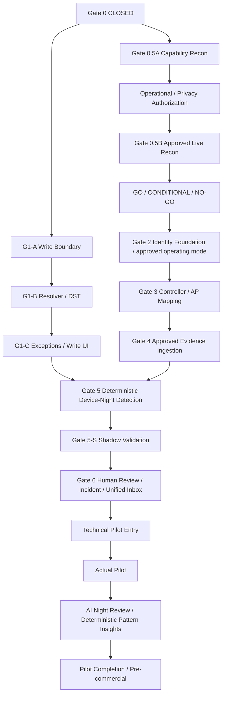

# Boarding Device Manager — Implementation Baseline v2

- Document status: IMPLEMENTATION BASELINE v2 — READY TO LOCK
- Decision date: 2026-09-07 (America/New_York)
- Scope: architecture/spec only. 이 문서의 결정은 구현 완료 또는 live-data 수집 승인이 아니다.
- Source baseline: production implementation `c27ef9d757c7933dd58cae2fd150e0093baf05f3`.
- Gate closure record commit: `70275c2724a575eb36e8ad281d17b1c13cf22ee2`.
- Gate 0: DSE-1B-1 — PRODUCTION PASS / CLOSED. 근거: [Gate record](gates.md).
- Custody 및 DSE-1B-1 production-pass 결과는 재심사하지 않는다. 아래 변경은 후속 Gate의 별도 범위이다.
- 이번 산출물은 이 문서 한 파일이다. migration, RPC, application/UI, controller, ingestion, detection, AI 구현은 수행하지 않는다.

## 1. Source of Truth 및 v1 → v2 changes

**DECIDED — D01.** 우선순위는 이번 사용자 baseline 요청 → Gate closure record → 해당 commit의 repo source이다. repo의 Markdown completion/verification convention을 재사용한다. 현재 파일 및 `git log --all --name-only -- docs`에 별도 architecture/baseline v1 파일은 없었다. 따라서 아래 비교는 사용자가 제시한 이전 방향에 대한 변경 요약이며, 확보하지 못한 v1 원문과의 검증된 diff가 아니다. 기존 문서를 삭제하거나 overwrite하지 않는다. 나중에 v1 원문이 제공되면 history로 보존하고 변경 이력을 추가한다.

| 영역 | v2에서 확정한 변경 |
| --- | --- |
| Gate dependency | Schedule G1-A/B/C와 Network 0.5A/Authorization/0.5B를 독립시킨다. |
| Reconnaissance | Capability와 approved live observation을 분리하고 그 사이에 학교 authorization을 둔다. |
| Network 의미 | Presence, session, activity, traffic delta를 분리한다. Presence는 학생 사용이나 물리적 보관의 증명이 아니다. |
| Private MAC | 정량 GO/CONDITIONAL/NO-GO, 수동 검증, unknown-only 대체 경로를 둔다. |
| Schedule | Write boundary → resolver/DST → allow exceptions/write UI 순서로 분할한다. |
| DST | restriction이 ambiguity 때문에 짧아지지 않도록 하는 의도적 제품 정책을 확정한다. |
| Detection | 하나의 device-night evaluator, 단일 cluster, 명시적 우선순위와 idempotency를 적용한다. |
| Evidence quality | clock offset, coverage gap, retrospective evidence를 결과에 포함한다. |
| Shadow | 14 overnight cycles와 정량 기준을 함께 통과해야 한다. 기간만으로 PASS하지 않는다. |
| Retention | 수치가 있는 제품 기본값과 학교별 승인 override를 둔다. |
| Review | Gate 6에서 `/app/review`로 통합하고 `/app/notices`는 redirect한다. Legacy generator는 유지한다. |
| AI | Pilot 안정화 후, Pilot Completion / Pre-commercial 이전에 read-only AI와 deterministic insights를 구현한다. |

확인한 현재 구조: `device_schedule_policies`와 `device_schedule_weekly_events`는 school/residence 범위의 weekly Release/Return foundation이다. weekday는 Monday=0, Sunday=6이며 날짜는 inclusive `effective_to`를 허용한다. 현재 foundation의 INSERT/UPDATE grants는 존재한다. 이것을 G1-A에서 통제하는 것은 예정된 후속 boundary 작업이며 Gate 0 실패로 재분류하지 않는다. 근거: [foundation migration](../../supabase/migrations/20260831000000_add_device_schedule_foundation.sql), [read data](../../lib/schedules/data.ts), [read UI](../../app/app/settings/schedules/schedule-management.tsx).

현재 operational device는 `device_custody_devices`이며 legacy notices는 `device_custody_notices`이다. 옛 schema 문서의 `devices` / `device_notices`를 새 기능의 연결 대상으로 추측하지 않는다. [현재 types](../../lib/devices/types.ts), [notices page](../../app/app/notices/page.tsx), [notice data access](../../lib/devices/data.ts)를 기준으로 한다. repo에는 현재 network identity 구현이 없으며 아래 network 모델은 신규 논리 계약이다.

## 2. Decision discipline 및 architecture invariants

**DECIDED — D02.** 본문의 D 번호 아래 규칙과 acceptance criteria는 모두 결정된 spec이다. `PROVISIONAL`은 architecture 결정 상태의 제3종류가 아니라 정량값의 실측 전 성숙도 표시이다. 해당 값을 임시 기준으로 채택하는 결정은 DECIDED이며, 확정 책임은 O registry에 연결한다. OPEN은 정확한 blocks, owner/decision source, must resolve by를 갖는다. OPEN을 해결하지 않고 지정 Gate에 진입하지 않는다. 다른 Track까지 암묵적으로 block하지 않는다.

| ID | Status | 고정 invariant / 요구 동작 |
| --- | --- | --- |
| D03 | DECIDED | Network Evidence ≠ Custody. Evidence 수집/identity 연결은 custody 상태를 쓰지 않는다. |
| D04 | DECIDED | Schedule ≠ Custody. Return은 요구 경계이고 Release는 허용 경계이다. 실제 반납/출고는 기존 authorized custody workflow만 기록한다. |
| D05 | DECIDED | Detection ≠ Incident. 새 incident는 명시적으로 권한 있는 사람이 evidence와 사유를 확인할 때만 생성한다. Legacy violation_foundation도 incident로 자동 변환하지 않는다. |
| D06 | DECIDED | AI ≠ Authoritative Fact. AI는 custody/detection/incident/identity/audit를 mutate하지 않고 operational fact를 생성하지 않는다. |
| D07 | DECIDED | Wi-Fi Presence ≠ Device Usage. Association, reconnect, roaming 또는 byte 증가도 학생의 의도적 사용을 확정하지 않는다. |
| D08 | DECIDED | Custody-storage AP presence ≠ physical custody proof. Compatible evidence로만 표시한다. AP coverage는 위치 추정이지 기기의 물리적 위치 인증이 아니다. |
| D09 | DECIDED | URL, DNS 기반 browsing history/site tracking, packet/message/app contents를 수집하지 않는다. Raw는 허용된 metadata 원형을 뜻하며 controller 전체 payload 보관을 뜻하지 않는다. |
| D10 | DECIDED | Tenant/school scope, 최소 권한, human authorization, provenance, versioning을 모든 새 경계에 적용한다. 서비스 secret을 client/AI에 제공하지 않는다. |

## 3. Revised Gate dependency graph

**DECIDED — D11.** 화살표는 entry dependency이다. Authorization은 단순 서명이 아니라 §15의 실제 요건 충족이다. Recon 0.5B의 제한적 observation은 Gate 4의 상시 ingestion과 별개이다.

G1-A/B/C는 0.5A, Authorization, 0.5B의 OPEN과 무관하게 순서대로 진행 가능하다. Gate 2의 pilot identity spec은 0.5B 결과 없이 확정하지 않는다. Gate 3/4는 Schedule 완료를 요구하지 않는다. Gate 5에서 두 Track이 합류한다. G1-A의 publish validation은 §5의 고정 구조 계약을 검사하며 G1-B 실행 구현에 의존하지 않는다.

NO-GO는 우회 PASS가 아니다. Gate 2에서 student-specific 모드는 차단하고, 학교가 unknown/network-level 모드로 pilot scope를 명시적으로 축소 승인한 경우에만 그 모드의 후속 Gate를 진행한다. 이 경우 학생 귀속·학생별 network compliance 성공을 주장할 수 없다. Mode 제한은 Gate 5-S, Pilot, Pre-commercial 기록까지 유지한다.

## 4. DECIDED / OPEN decision registry

| ID | Status | 결정 범위 / 상세 근거 |
| --- | --- | --- |
| D01–D02 | DECIDED | Source precedence, v1 history 보존, 결정 상태 규약 (§1–2) |
| D03–D10 | DECIDED | 고정 invariants와 데이터 최소화 (§2) |
| D11 | DECIDED | 두 Track의 DAG, NO-GO scope 경로 (§3) |
| D12 | DECIDED | Atomic publish, scope lock, immutable policy와 append-only publication (§5.1) |
| D13 | DECIDED | Resolver precedence, weekly ring, window contract (§5.2) |
| D14 | DECIDED | DST conservative boundary (§5.3) |
| D15 | DECIDED | Allow-only exception, 권한, Write UI (§5.4) |
| D16 | DECIDED | Metadata evidence model, presence/activity 구분 (§6) |
| D17 | DECIDED | Location taxonomy와 versioned AP mapping (§7) |
| D18 | DECIDED | Non-student 분류, network scope exclusion (§8) |
| D19 | DECIDED | Network identity와 HMAC security/lifecycle (§9) |
| D20 | DECIDED | Recon 단계 및 provisional identity thresholds (§10) |
| D21 | DECIDED | Clock quality, coverage, backfill (§11) |
| D22 | DECIDED | Device-night evaluator, rule priority (§12) |
| D23 | DECIDED | Evidence/cluster dedupe와 review revision (§13) |
| D24 | DECIDED | Shadow 정량 기준과 측정 denominator (§14) |
| D25 | DECIDED | Operational/privacy entry 및 권한 (§15) |
| D26 | DECIDED | Retention 수치 기본값 및 override (§16) |
| D27 | DECIDED | Unified Review와 legacy route/generator 처리 (§17) |
| D28 | DECIDED | Pilot 및 AI activation/exit (§18) |
| D29 | DECIDED | Scenario catalog, 모든 Gate exit, evidence 규칙 (§19–20) |
| D30 | DECIDED | Self-review 및 docs-only lock 절차 (§21) |

다음 OPEN은 외부 환경 결정을 정확한 entry까지 유보한다. 이 표의 Gate별 blocks는 직접 blocker이며 후속 dependency도 함께 막는다. O registry 외에 숨은 architecture OPEN은 없다.

| ID | Status | 결정할 항목 | blocks | owner / decision source | must resolve by |
| --- | --- | --- | --- | --- | --- |
| O01 | OPEN | 실제 vendor/model/firmware, API credential 방식, endpoint/field/rate/timestamp 문서와 sanitized capability report | Operational / Privacy Authorization | 학교 IT/controller owner + 0.5A의 vendor 공식 문서 | Operational / Privacy Authorization entry |
| O02 | OPEN | 학교명별 승인자, 목적·fields·접근자 명단·수집 범위·보존 override·학년도 종료일·notice/consent 및 필요한 legal/policy 판단 | Gate 0.5B | 학교 지정 policy/privacy 책임자 + IT credential owner + 해당 시 legal reviewer | Gate 0.5B entry |
| O03 | OPEN | 실제 attribution 수치, Private MAC 검증 결과, 최종 GO/CONDITIONAL/NO-GO와 승인 network/device cohort | Gate 2 | 학교 IT + product owner + 0.5B evidence | Gate 2 entry |
| O04 | OPEN | 실제 timestamp/clock·poll interval·counter/reset semantics, activity/grace threshold 최종값 또는 activity-unavailable mode | Gate 2 | integration engineer + 학교 IT; 0.5B 측정과 vendor 문서 | Gate 2 entry |
| O05 | OPEN | 실제 AP inventory와 AP→location/residence 검증 결과, unmapped 목록 및 제외 scope | Gate 4 | 학교 IT/residence 운영자; Gate 3 mapping survey | Gate 4 entry |
| O06 | OPEN | §14 provisional 수치의 학교별 최종 승인, 실제 evaluator roster, reviewer 명단·측정 계획 | Gate 5-S | product owner + 학교 운영 책임자; 0.5B 및 Gate 4/5 결과 | Gate 5-S entry |
| O07 | OPEN | 운영 pilot 기간/대상 roster·담당자·연락 경로·rollback 책임자와 승인 기록 | Technical Pilot Entry | 학교 운영 책임자 + product owner; Gate 6 결과 | Technical Pilot Entry entry |
| O08 | OPEN | AI provider/model·지역·처리계약·provider retention·approved fields 및 evaluation fixture | AI Night Review | 학교 privacy 책임자 + product owner; 안정된 pilot evidence, provider 공식 조건 | AI Night Review entry |

각 OPEN 해소는 값, evidence, 승인자, effective date를 기록한다. 기존 DECIDED나 threshold를 바꾸면 이유와 버전 변경을 남기고 관련 acceptance를 다시 수행한다. Shadow 결과를 본 뒤 기준을 낮춰 같은 실행을 PASS로 바꾸지 않는다.

## 5. Schedule architecture

### 5.1 G1-A — Schedule Write Boundary

**DECIDED — D12.** Schedule authoritative write는 server-validated DB transaction/RPC로만 수행한다. Client의 schedule policy/event direct INSERT/UPDATE/DELETE/UPSERT 경로와 grants를 제거한다. 기존 read 권한·custody RPC·DSE-1B-1 read UI는 유지한다. 이것은 future migration spec이며 이 baseline 작업에서 적용하지 않는다.

- Manager matrix는 기존 foundation을 따른다: super_admin은 전체, school_admin은 자신의 school/residence, dorm_supervisor는 자신의 school의 residence 정책만 publish한다. dorm_staff/viewer/student/parent는 publish 불가. server가 실제 user·school·residence membership과 active 여부를 확인한다.
- Publish 단위는 policy metadata + 전체 weekly event 집합 + publication/supersession metadata + audit + idempotency 결과이다. 한 transaction에서 모두 commit하거나 모두 rollback한다.
- Scope key는 `(school_id, school-wide sentinel 또는 residence_id)`이다. 아직 policy row가 없는 scope도 lock해야 한다. transaction-scoped advisory lock을 scope별로 잡고, 변경 시 expected scope revision을 재확인한다. 여러 scope를 다룰 때는 정렬한 key 순으로 lock한다. PostgreSQL은 transaction-level advisory lock을 제공한다. [공식 locking 문서](https://www.postgresql.org/docs/current/explicit-locking.html)
- 같은 scope 동시 publish 중 stale revision은 명시적인 conflict 결과이며 overwrite하지 않는다. 같은 idempotency key + 같은 payload는 원래 결과를 반환하고, 다른 payload는 reject한다. tenant/user 범위의 key와 payload digest를 audit에 연결한다.
- 같은 scope의 최종 effective interval overlap을 reject한다. School-wide와 residence interval의 동시 존재는 서로 다른 scope이므로 허용한다. DB boundary는 모든 production writer에 적용하며 privileged ingestion도 schedule을 쓸 권한이 없다.
- Published policy content, event 집합, timezone snapshot은 publish 시부터 immutable이다. 활성/과거 policy의 content, effective_from, declared effective_to, is_active를 직접 변경하거나 삭제하지 않는다. Published future version도 편집은 새 version으로 대체한다. Draft만 수정/폐기할 수 있다.
- Draft는 기존 DSE-1B-1 SELECT에 노출되는 published policy/event 집합에 저장하지 않는다. Publish가 성공할 때만 해당 read model에 완전한 snapshot을 노출한다. Draft 저장 방식은 이 visibility 계약을 충족해야 한다.
- 무기한 current policy와 future version을 함께 지원하기 위해 **append-only publication/supersession 이력**을 둔다. 새 version은 정확한 predecessor와 미래 cutover를 지정한다. Current row의 날짜를 줄이는 대신 ledger에 cutover를 추가하여 predecessor의 실제 해석 interval을 종료한다. 논리적 publication 이력은 policy의 일부이며 임의의 active row edit가 아니다.
- Effective interval은 `[local start-of-day(effective_from), min(declared inclusive effective_to 다음 날, authorized successor cutover))`이다. 검사는 raw declared 날짜의 겉보기 overlap이 아니라 ledger를 적용한 실제 publication interval에 대해 수행한다. Supersession 없이 겹치는 요청은 reject한다. 서로 다른 successor가 같은 scope revision을 대체할 수 없다.
- 최초 publish와 replacement는 학교 날짜 기준 내일 이후 local midnight에 발효한다. 과거/당일 발효는 launch에서 금지한다. 미래 체인을 바꾸려면 아직 시작하지 않은 부분만 explicit cancel/supersede하고 전체 resulting timeline을 원자적으로 재검사한다. 과거 해석은 바뀌지 않는다.
- 기존 read model의 declared 날짜와 `is_active`는 즉시 효력 보장으로 간주하지 않는다. Authoring workflow는 authoritative resolved effective interval을 표시한다. G1-A가 기존 DSE-1B-1 화면을 resolver나 write 화면으로 변환하지 않는다.
- SQL boundary 권한은 direct DML revoke와 양립하는 최소권한 전용 owner/privileged routine으로 제한한다. 명시적 actor/tenant 검사, 고정 search_path, schema-qualified 참조, PUBLIC/anon EXECUTE revoke, 필요한 authenticated entry만 grant한다. Client supplied actor를 신뢰하지 않는다. [Supabase functions의 invoker/definer 및 실행 권한 설명](https://supabase.com/docs/guides/database/functions)을 구현 때 재확인한다.
- G1-A validation contract: 빈 event 집합, duplicate local instant, 잘못된 weekday/time/zone/date, Return/Release가 교대로 이어지지 않는 circular ring은 reject한다. 최소 한 Return과 한 Release가 필요하다. UTC resolver 구현 없이 local ring의 구조를 검증할 수 있다. 실제 DST/resolution은 G1-B 소유이다.

이 ledger는 활성 정책 불변성과 future replacement를 동시에 충족하기 위한 결정이다. SQL 이름/인덱스 코딩은 G1-A에서 이 계약대로 정하며 baseline에는 migration/RPC body를 작성하지 않는다. Immutable publish snapshot과 ledger가 Source of Truth이고 client cache는 아니다.

### 5.2 G1-B — Deterministic Resolver

**DECIDED — D13.** Resolver 입력은 school, device/student residence assignment의 as-of snapshot, instant/range, publication revision, school IANA timezone snapshot이다. 출력은 `RESTRICTED`, `ALLOWED`, `UNCONFIGURED`, `INVALID` 중 하나와 policy/version provenance, reason, UTC 경계이다. UNCONFIGURED/INVALID는 ALLOWED가 아니며 자동 학생 위반 판단도 아니다. 관리자가 설정을 고칠 review reason으로 노출한다.

1. 각 시간 구간에서 effective published residence policy가 있으면 school-wide를 완전히 override한다. 두 policy event를 섞지 않는다. Residence가 없으면 school-wide로 fallback한다. 선택된 residence policy가 invalid이면 school fallback으로 숨기지 않고 INVALID다.
2. Weekly event를 Monday=0 기준 local weekday/time으로 정렬하고 circular하게 전후 주를 순회한다. 바로 이전 Return에서 다음 Release까지 `[return, release)`가 restriction이다. Release instant부터는 허용이다. Sunday→Monday, 주를 넘어가는 구간, cross-midnight 모두 같은 규칙이다.
3. 선택된 policy의 weekly template을 이전/다음 주까지 확장해 구간 진입 상태를 계산한다. Policy 시작일 자정에 그 template이 restricted이면 자정부터 restriction이 시작된다. Policy end/successor/residence 변경 경계에서 구간을 나누어 새 template을 적용한다. 앞 policy event를 새 policy event와 임의로 짝짓지 않는다.
4. 각 publication 선택 구간에 DST-resolved restriction을 clip하고, 겹치거나 접한 restriction을 합쳐 canonical restricted window를 만든다. Cutover 양쪽이 restricted이면 하나의 연속 window이며 provenance는 양쪽 version을 보존한다. Unconfigured 구간은 이어 붙이지 않는다.
5. Window는 stable `restricted_window_id`, tenant, applicable scope/assignment snapshot, `restricted_window_start/end` UTC, local labels, timezone 및 resolver/tzdata version을 갖는다. Device-night는 달력 날짜가 아니라 **device × canonical restricted window**이다. 하루 여러 구간은 여러 device-night일 수 있다.
6. 과거 window 및 평가 snapshot은 재생 가능하게 보존한다. 학교 timezone 변경은 미래 publication으로 반영하며 과거 timestamp를 재해석하지 않는다. tzdata/runtime 업데이트는 versioned 배포·회귀 검증을 거치고, 이미 고정된 window를 조용히 rewrite하지 않는다.
7. Residence/device assignment history가 없는 과거 구간은 현재 소속을 소급 적용하지 않는다. 확인 가능한 as-of custody/schedule/assignment만 사용하고 나머지는 unknown/configuration gap이다.

### 5.3 DST product decision

**DECIDED — D14.** “Restriction is intentionally biased toward not becoming shorter when resolving DST ambiguity/nonexistent local times.” 이는 라이브러리 default가 아닌 제품 정책이다. 이 결정은 ambiguity 해석의 선택에 대한 것이며 모든 계절에서 실제 UTC restriction duration을 동일하게 보장한다는 뜻은 아니다.

| local 경계 | Fall-back: 같은 local time의 두 instant | Spring-forward: 존재하지 않는 local time |
| --- | --- | --- |
| Return = restriction start | 더 이른 instant | gap 길이만큼 이전으로 해석한 instant |
| Release = restriction end | 더 늦은 instant | gap 길이만큼 이후로 해석한 instant |

Gap은 1시간으로 하드코딩하지 않는다. Zone transition의 실제 offset 차이를 사용한다. 예를 들어 02:00→03:00 gap의 02:30 Return은 01:30에 대응하는 earlier instant, 02:30 Release는 03:30에 대응하는 later instant다. 01:30이 반복되는 fold의 Return은 첫 번째, Release는 두 번째다. Library의 earlier/later 모드가 이 의미를 충족하는지 fixture로 검증한다. 시간대 변환의 기술적 배경은 [TC39 timezone/ambiguity 문서](https://tc39.es/proposal-temporal/docs/timezone.html)이며 보수적 선택 자체는 이 제품의 결정이다.

같은 날 여러 event가 변환 후 겹치면 restriction interval을 union한다. UTC end ≤ start, 해석 불가능한 timezone, 지원하지 않는 transition이면 INVALID로 처리하고 학생 detection을 만들지 않는다. Explicit allow exception의 UTC interval은 DST로 확장하지 않는다. Local exception 입력이 모호하면 offset 선택/미리보기를 요구하고, nonexistent time 입력은 reject한다.

### 5.4 G1-C — Allow exceptions + Write UI

**DECIDED — D15.** Launch exception effect는 `allow`만이다. 대상은 같은 school의 device, student, residence 중 정확히 하나다. 시작/종료 UTC instant가 있는 `[start, end)`이며 reason, actor, created_at, revoke actor/time/reason을 audit한다. 생성 시 미래 또는 현재 이후만 허용하고 retrospective create/revoke로 과거 finding을 없애지 않는다. 수정은 revoke + 새 exception이다.

- 권한: super_admin/school_admin은 허용 scope 전체, dorm_supervisor는 자신의 school의 residence 및 그 residence에 속한 student/device에만 가능하다. 다른 role은 생성/취소 불가. Assignment와 scope는 서버에서 검증한다.
- 적용 가능한 allow interval의 union을 base restriction에서 빼면 effective restriction이 된다. 겹친 allow 하나를 revoke해도 다른 allow가 남아 있으면 계속 허용이다. 원래 restricted_window_id/start는 그대로 두어 exception 때문에 cluster가 늘어나지 않는다.
- Student/residence 예외는 event 당시 소속에 적용한다. 예외 시작 또는 종료로 재개된 restriction에는 §12의 submission grace를 다시 적용한다. Explicit allow는 반납 의무/활동 제한을 그 구간에 면제하지만 custody가 returned라는 사실을 checked_out으로 바꾸지 않는다.
- Custody-network conflict는 custody 기록과 관측의 확인 요청이므로 allow만으로 사라지지 않는다. 이 finding 역시 학생 사용이나 위반 확정은 아니다.
- 더 강한 시험기간 제한은 `effect=restrict`를 추가하지 않고 future-dated policy version과 이후 정상 policy version을 예약한다.
- 별도 authoring workflow에서 weekly Release/Return draft, DST/UTC preview, actual publication interval, future supersession, conflict retry, 예외 create/revoke를 제공한다. Publish 전 서버 preview와 제출 revision을 확인한다. 이미 effective한 policy에 inline edit를 제공하지 않는다.
- 첫 controlled production policy creation 시 Gate 0에서 deferred한 실제 school/residence policy rendering QA를 수행한다. G1-C 종료 증거에 연결하며 Gate 0 QA를 소급 VERIFIED로 바꾸지 않는다.

## 6. Network evidence model / Presence vs Activity

**DECIDED — D16.** Logical observation contract는 다음과 같다. 물리 테이블 수는 Gate 2/4의 책임 범위에서 이 계약에 필요한 최소로 정한다. 이미 존재하는 custody/device/student identity를 복제하지 않는다.

| 논리 항목 | 필수 의미 |
| --- | --- |
| Provenance | school_id, integration_id, source_event_id 또는 deterministic source fingerprint, adapter/schema version, poll batch/cursor |
| Identity reference | network identity reference + key version, nullable verified physical-device association, association/mapping revision |
| Network scope | controller/AP identifier, 승인 SSID/VLAN/scope reference; 불필요한 hostname은 기본 수집하지 않음 |
| Event kind | presence_snapshot, session_start/end, reassociation, activity_sample, traffic_delta, roam, disconnect/reconnect |
| Time | source timestamp 원값/semantics, observed_at, ingested_at, clock measurement reference, uncertainty interval |
| Activity | last_activity_at semantics, counter kind/unit/direction, interval start/end, delta, reset/wrap/quality; 미지원은 null/unsupported |
| Location | AP mapping revision, location_type, residence reference, certainty/unknown |
| Coverage | LIVE/RETROSPECTIVE/PARTIAL_COVERAGE, gaps, source support matrix |

Presence는 controller가 client association을 보고했다는 뜻이다. Poll마다 present인 것을 session start로 세지 않는다. Session/reassociation은 연결 변화이고 activity를 의미하지 않는다. AP roam은 연결 continuity에 속한다. Recent activity는 vendor가 timestamp가 무엇을 뜻하는지 문서로 보장한 경우에만 activity metadata로 인정한다. Traffic delta는 같은 identity/session/counter 계열의 순서가 있는 두 sample 사이 증가량이며 packet 내용을 포함하지 않는다.

Counter reset/wrap/reboot, aggregate interval이 restriction 경계를 걸치는 경우, scope 변경, sample 순서 역전은 delta를 사용량으로 추정하지 않는다. 마지막 sample의 total을 interval delta로 쓰지 않는다. Supported=false 또는 unknown을 zero activity로 채우지 않는다. Background sync/OS keepalive 가능성을 staff 설명에 항상 유지한다.

**DECIDED provisional activity screen:** 유효한 5분 안에 서로 겹치지 않는 두 positive-delta interval, 합계 ≥64 KiB, 총 관측 span ≥120초를 충족하면 review용 `qualified_activity` 후보로 본다. 각 interval은 같은 identity/session이며 승인 scope와 정상 timestamp/counter 조건을 충족해야 한다. Activity 자체는 schedule/allow 여부와 독립적으로 분류하고, §12의 각 rule이 필요한 base/effective restriction 및 custody grace에 interval 전체가 포함되는지를 따로 검사한다. `PROVISIONAL — finalize at Gate 0.5B` (O04). 이 수치는 인간의 사용을 판정하는 기준이 아니다. Recent-activity-only source는 O04에서 검증된 대체 기준이 명시적으로 확정되지 않으면 lower-confidence corroboration으로만 쓴다. Presence-only integration은 활동 기반 학생 detection을 비활성화한다.

## 7. Network location semantics

**DECIDED — D17.** `network_locations.location_type` 논리 enum은 다음 일곱 값으로 고정한다.

| 값 | 평가에서의 의미 |
| --- | --- |
| custody_storage | 수거/충전 구역과 compatible coverage. Physical custody proof 아님. |
| student_living | 기숙사 생활공간 coverage. 위치만으로 활동/사용 확정 불가. |
| academic | 교실/학습 구역 coverage. 자동 allow exception이 아님. |
| common_area | 공용구역 coverage. Student 귀속은 identity 검증 필요. |
| staff | 직원 구역 coverage. Student device를 자동 staff로 분류하지 않음. |
| infrastructure | 네트워크 설비 구역 coverage. 물리 device category와 별개. |
| unknown | 미매핑 또는 구역 구분 불가. 위치 기반 high-confidence finding 금지. |

AP→location/residence 매핑은 effective interval, 검증자·시각·근거·revision을 가진다. 공유 coverage가 서로 다른 의미의 구역을 덮으면 한 AP를 custody_storage의 확정 위치로 취급하지 않고 unknown/ambiguous로 둔다. 여러 AP가 하나의 location에 연결될 수 있다. AP 이름만 보고 자동 승인하지 않는다. Unmapped AP 관측은 버리지 않고 승인된 scope 안에서 unknown으로 보관한다. Gate 3의 mapping accuracy는 AP의 설정된 coverage 분류 정확도이며 개별 단말의 정확한 물리 위치 정확도가 아니다.

## 8. Non-student devices와 exclusions

**DECIDED — D18.** 일반화한 network identity classification은 `registered_student_device`, `staff_device`, `infrastructure`, `shared_asset`, `guest`, `excluded`, `unresolved`를 표현한다. 분류 변경은 authorized staff가 근거/유효시간과 함께 기록한다. 학생 기기와 연결되지 않은 identity에 student_id를 강제로 부여하지 않는다.

기존 `device_custody_devices`는 student_id가 필수인 운영 device model이다. 이를 non-student row로 오염시키지 않는다. 새 network identity layer에서 classification과 nullable existing custody-device link를 표현한다. 별도 staff/guest/infrastructure별 device 테이블은 만들지 않는 방향으로 고정한다. 하나의 검증된 student device에는 여러 network identity link를 허용한다.

SSID/VLAN/controller-site/integration 단위 exclusion을 **지원한다**. Exact scope identifier, reason, approver, effective interval을 versioning한다. 수집 최소화를 위한 exclusion은 controller/API filter가 있으면 upstream에, 없으면 persist 전에 적용한다. Excluded scope의 presence를 absence로 해석하지 않으며 해당 device의 coverage denominator에서도 자동 삭제하지 않는다. Scope 때문에 의도한 roster를 못 보면 coverage 부족이다. 등록 roster 자체의 변경은 별도 승인 후 미래부터만 적용한다.

Staff/infrastructure/shared_asset/guest/excluded는 학생 compliance evaluator 대상이 아니다. Unresolved는 승인된 network-level review만 가능하며 학생 attribution을 만들지 않는다. Stable-identity 충돌은 operational identity queue로 보내며 자동 merge하지 않는다.

## 9. Identity / Private MAC / security

**DECIDED — D19.** MAC-only physical identity는 금지한다. MAC, hostname, time proximity 조합만으로 학생을 자동 귀속하지 않는다. Identity link는 controller/network scope, validity interval, source method, verifier, evidence reference, confidence state (`unverified`, `verified`, `disputed`, `revoked`)를 갖는다. `verified`이며 해당 관측 시점에 유효한 unique link만 student-specific 평가에 사용한다. Disputed link는 즉시 학생 귀속을 중단한다.

하나의 network identity는 동일 scope/시간에 서로 다른 physical device 두 개에 verified-link될 수 없다. 하나의 physical device는 Private MAC 변경/SSID 차이 등으로 여러 identity를 가질 수 있다. Stable controller client ID도 검증 근거이며 물리적 동일성의 무조건 보장은 아니다. Link 생성은 custody state를 쓰지 않는다.

HMAC을 사용할 때는 school/integration/network scope + identity kind + canonical raw identifier를 domain-separated 입력으로 사용한다. `identity_key_version`은 필수이며 secret은 서버에서만 관리한다. HMAC 목적은 raw identifier 우발적 노출 최소화이고 secret compromise 이후 MAC anonymity 보장이 아니다. HMAC 값도 개인정보 취급 범위에서 retention/access를 적용한다.

- Secret rotation 후 신규 관측/link는 new version을 사용한다. 기존 link와 evidence reference는 old version을 유지하며 historical rewrite하지 않는다.
- Rotation 동안 승인된 제한 기간(기본 30일) 서버에서 old/new version을 비교해 동일 association을 확인할 수 있다. 명시적인 version bridge를 audit하고 raw를 저장해 두었다가 재해싱하지 않는다. Bridge가 불가능하면 manual re-verification 전까지 unresolved다.
- Old secret 제거 후에도 보존 중인 old evidence의 opaque reference는 유지할 수 있다. 새로운 raw와 old link 비교 가능성을 보장하지 않는다. Incident reference가 있다고 old secret을 무기한 보존하지 않는다.
- Manual verification: authorized staff 입력 → server-side normalize/HMAC → stored identity_key comparison → scope 충돌 검사 → verification record. Client는 raw 입력을 local storage/log/analytics에 남기지 않는다. 일반 UI에는 masked hint만 허용한다.
- Sensitive identity view/verification/relink/export 및 실패한 권한 시도는 보안 audit 대상이다. 원 MAC, credentials, 전체 payload를 audit에 복제하지 않는다.
- Re-verification/학생 소속 변경은 새로운 effective association이다. 과거 잘못된 귀속 정정은 기록된 correction 및 재평가 revision으로 표현하고 과거 audit/incident를 자동 수정하지 않는다.

## 10. Gate 0.5A / Authorization / 0.5B 및 GO 판정

**DECIDED — D20.** 0.5A에서는 vendor 공식 문서, controller 관리 metadata, sanitized export만 사용한다. Device/client live endpoint를 authorization 전에 호출하지 않는다. Capability를 student data와 분리해 확인할 수 없으면 해당 항목을 unsupported/not established로 적고 0.5B로 넘긴다. 우연히 live identifiers가 노출되면 수집을 중단하고 학교 정책에 따라 처리하며 문서에 복제하지 않는다. Controller/network configuration mutation은 두 단계 모두 금지한다.

| 0.5A capability report 필수 항목 | 0.5B authorized observation 필수 항목 |
| --- | --- |
| Vendor/model/firmware, API availability/version, cloud/LAN architecture | Night client count, student/non-student ratio 및 unresolved 비율 |
| Authentication, credential owner, least-read scope | 승인 SSID/VLAN, dorm AP, custody-storage coverage |
| Location/AP API, supported fields 및 unsupported 구분 | Private MAC behavior, stable client identity, 자연 발생 roam/reconnect/reassociation |
| Session/reassociation semantics, counters와 reset 의미 | Traffic/activity counters의 실제 값·sample interval·reset 처리 |
| Timestamp units/timezone/meaning, polling/rate limits | Controller/server offset, jitter, source clock 품질 |
| Backfill range/cursor/dedup, documented outage behavior | 실제 이용 가능한 backfill/outage evidence와 미관측 한계 |

0.5B는 승인된 최소 roster/scope와 종료시각 안에서 기본 3 complete overnight observation cycles를 사용한다. 실제 outage/Private MAC rotation이 발생하지 않았으면 발생했다고 보고하지 않는다. Vendor 문서 및 sanitized fixtures를 보완 증거로 구분하고 live 미검증 항목에 운영 mode 제한을 명시한다. Active reconnect, Wi-Fi 설정 변경, 네트워크 장애 유도는 수행하지 않는다.

**PROVISIONAL — finalize at Gate 0.5B (O03).** Attribution denominator는 사전에 승인한 전체 intended pilot student-device roster의 physical devices 수다. 관측된 MAC 수가 아니며 offline/unseen/unresolved devices도 denominator에 포함한다. Reliably attributable numerator는 network scope 및 validity가 검증되고, 표본 관측 동안 충돌/임의 추정 없이 연결되며, reassociation/Private MAC에 대한 verification evidence 또는 명시적 scope 제약이 있는 physical devices 수다. 샘플이 아닌 pilot roster census로 보고한다.

| 판정 | 정량 starting threshold | 추가 필수 조건 / 효과 |
| --- | --- | --- |
| GO candidate → GO | ≥90% reliable attribution | 유효 verified link의 중복 학생 귀속 0, 사용 scope의 충분한 검증, O02/O04 충족. 미검증 나머지는 unresolved 유지. |
| CONDITIONAL | ≥70% 및 <90%, 또는 ≥90%라도 manual/scope 제한 필요 | 수동 검증 runbook, 허용 cohort와 비활성 cohort를 명시. Student-specific 결과는 verified subset만. |
| NO-GO candidate → NO-GO | <70%, 또는 허용 scope에서 신뢰 가능한 unique association 불가 | Student-specific network compliance 차단. School-approved unknown/network-level pilot만 별도 scope로 허용. |

Threshold 충족만으로 GO하지 않는다. Unresolved collision, Privacy 미승인, 실제 source semantics의 불명확성이 있으면 GO 불가이다. Collision이 격리된 소수 identity에만 한정되고 나머지 verified scope가 안전하면 CONDITIONAL로 범위를 제한한다. 숫자를 바꾸면 실측 근거·승인자·새 값을 DECIDED로 기록한다.

NO-GO 대안은 다음 순서로 검토하고 결과를 각각 supported/unsupported/rejected와 근거로 기록한다: controller stable client identity → 기존 802.1X/RADIUS identity → manually verified network-scoped identity → optional existing MDM evidence → student-specific detection 보류, unknown/network-level 운영. 새 RADIUS/MDM 배포를 필수로 요구하지 않는다. MDM은 core product/mandatory dependency가 아니다. 대안 검증이 끝나기 전 MAC/hostname/time proximity로 fallback하지 않는다.

## 11. Clock / outage / backfill

**DECIDED — D21.** `observed_at`은 source가 관측한 event time, `ingested_at`은 서버 수신시각이다. 둘을 대체하지 않는다. Source local timestamp가 모호하고 offset/zone을 증명할 수 없으면 timestamp quality=unknown으로 격리한다.

Integration health는 offset의 부호 정의(controller time − server time), `measured_at`, sample count, measurement method, RTT/jitter bound, source timestamp semantics, poll cadence, freshness 상태를 기록한다. 보정된 event center는 observed_at − measured offset이며 raw timestamp는 승인 metadata retention 동안 보존한다. Server receive time을 source event time으로 위장하지 않는다.

**PROVISIONAL — finalize at Gate 0.5B (O04):** measurement freshness ≤15분, residual uncertainty/jitter bound ≤30초, polling interval ≤60초를 starting profile로 한다. Activity/disconnect grace는 120초, submission grace는 5분이다. Vendor rate limit 때문에 달성 불가하면 polling/grace/mode를 O04에서 실측 기반으로 다시 확정한다. 무단 polling으로 rate limit을 넘지 않는다.

Raw source 경계 비교에 필요한 총 grace budget은 `abs(measured offset) + residual uncertainty + activity/disconnect grace`다. 실제 evaluator는 **보정한 center**와 uncertainty interval을 사용하므로 abs(offset)을 다시 더하지 않는다. 보정된 event 전체 interval이 custody return/restriction 경계의 120초 grace 이후에 있어야 timing-dependent actionable candidate가 된다. Timestamp stale/unknown이면 high-confidence timing finding을 만들지 않고 quality queue로 보낸다.

| Coverage state | 의미와 처리 |
| --- | --- |
| LIVE | 승인 cadence/clock 조건을 충족하는 현재 observation. 연속 interval별 coverage를 측정. |
| RETROSPECTIVE | 지연/backfill event. source time과 source coverage를 표시하고 retrospective 결과로 평가. |
| PARTIAL_COVERAGE | missing poll, API failure, unsupported activity, ambiguous time/scope 등 relevant evidence의 공백. gap start/end/reason을 표시. |

Window 안에 live/retrospective/partial segment가 함께 있을 수 있다. Window summary는 미복구 gap이 있으면 PARTIAL_COVERAGE이며 retrospective 비율을 별도로 노출한다. No detection ≠ No unauthorized use. Client가 보이지 않음은 controller가 정상 관측 중임을 뜻하지 않는다.

Backfill은 bounded cursor/checkpoint, deterministic dedupe, retry/backoff, retention cutoff를 적용한다. Activity interval이 gap을 가로지르면 사용량을 분배하지 않는다. Replayed event는 과거 window를 source-time 기준으로 평가하고 retrospective revision/queue로 묶는다. Real-time 알림을 재발송하거나 과거 사건을 현재 긴급 incident로 만들지 않는다. Shadow에서는 모든 학생/보호자 알림을 비활성화한다. Gate 6/Pilot도 학생/보호자 자동 발송은 범위에 포함하지 않는다.

## 12. Deterministic Device-Night Evaluator

**DECIDED — D22.** 단일 경계 `evaluate_device_night(device_id, restricted_window_id)`를 둔다. Signature는 논리 계약이며 이번 문서에서 함수를 구현하지 않는다. Server-authorized tenant context에서 custody event history, schedule/window revision, allow exceptions, identity link history/confidence, network presence/activity, location mapping, coverage/clock snapshot, evaluator/rule version을 입력으로 고정한다.

같은 snapshot과 version이면 input order, retry, worker 수와 무관하게 같은 cluster 결과를 산출한다. Window별 transaction/lock으로 평가를 serialize하고, 늦은 event는 기존 cluster의 새 revision을 만든다. Rule별 독립 insert race를 허용하지 않는다.

| 순위 | Candidate | 최소 조건 / 제외 |
| --- | --- | --- |
| 1 | custody_network_conflict | verified student device의 as-of custody가 returned; base restricted window 안의 승인된 non-storage location에서 qualified activity가 return grace 뒤에 존재; timestamp·location quality 충분. Storage/unknown AP presence만으로는 생성 불가. Allow exception은 custody contradiction을 해소하지 않음. |
| 2 | restricted_period_activity | effective restricted interval 안에 verified device의 qualified activity; valid schedule, identity, timestamp; allow 구간 제외. Custody_storage 활동은 낮은 신뢰의 review context이며 학생 사용 확정 불가. |
| 3 | submission_overdue | active 등록 대상 device가 effective return deadline + 5분 후에도 as-of custody checked_out. Allow, inactive/lost, 불명확한 custody/assignment 구간 제외. Network 관측 유무와 독립. |

우선순위는 **DECIDED: conflict > restricted activity > submission overdue**다. 한 cluster에 primary 하나와 subordinate reasons를 보존한다. Higher priority가 발견되어도 lower reason을 삭제하지 않는다. Identity/location/timestamp가 부족한 network observation은 unknown/quality queue로 가고 학생별 actionable finding으로 승격하지 않는다.

Presence 또는 session-only outside storage는 corroborating context로 표시할 수 있으나 위 두 activity-based candidate의 최소 조건을 충족하지 않는다. `high-confidence`는 evidence association/timing과 review relevance의 신뢰도이며 의도적 학생 사용의 확률이 아니다. Storage AP의 activity도 background traffic일 수 있으므로 high-confidence conflict로 삼지 않는다.

Submission overdue는 schedule의 의무 평가만 추가하며 기존 custody의 return_due_at, legacy overdue 로직 또는 state를 자동 rewrite하지 않는다. Allow 종료 후 restriction이 재개되면 종료시각 + submission grace가 새 요구 경계다. 같은 base window에 속한 재개는 동일 cluster 안에서 다룬다. Network gap이 있어도 독립적으로 증명되는 custody/schedule overdue는 가능하며 network coverage 한계를 함께 표시한다.

Worker는 detection/evaluation 결과만 기록할 수 있다. Custody, identity association, incident confirmation 권한은 부여하지 않는다. 불명확한 입력에 단정적인 false/true를 채우지 않고 reasoned insufficient evidence 상태를 산출한다.

Unknown-only 모드의 deterministic companion boundary는 `evaluate_network_scope_window(integration_id, approved_scope_id, restricted_window_id)`다. 실제 학생/device를 만들어 대입하지 않는다. 사전 승인된 network scope에 school-wide 또는 검증된 residence schedule을 적용하고, 그 base restriction 안의 unresolved qualified activity를 `unresolved_network_activity` 한 cluster로 요약한다. 이는 네트워크 구역의 검토 후보이며 특정 학생의 규정 준수 판단이 아니다. Staff/guest/excluded로 확인된 identity는 제외한다. Location이 unknown이면 school-wide 승인 scope만 사용하며 특정 residence에 추정 귀속하지 않는다. Schedule이 unconfigured/invalid이면 activity detection 대신 coverage/configuration report만 남긴다.

Unknown-only scope는 custody conflict/submission overdue를 생성하지 않는다. Student-specific 기능을 끈 상태의 기능 테스트와 network-level quality/workload report로 검증한다. Activity source가 없는 health/presence-only mode를 activity-detection PASS로 포장하지 않는다. 이 경우 모니터링 준비 결과만 기록하고 해당 detection pilot의 Gate 5-S는 종료하지 않는다.

## 13. Dedupe / review revision model

**DECIDED — D23.** 두 수준의 idempotency를 분리한다.

- Observation uniqueness: tenant + integration + vendor event ID. ID가 없으면 normalized source identity/session + source time/interval + kind + source sequence/counter fingerprint를 사용한다. Poll time만으로 매번 새 event를 만들지 않는다.
- Detection cluster uniqueness: `(school_id, device_id, restricted_window_start UTC)`. 특히 custody_network_conflict dedupe는 요청된 `device_id + restricted_window_start`에 tenant 경계를 추가한 것이다. AP/session/identity-key-version/rule/evaluator revision은 cluster key가 아니다.
- `restricted_window_id`와 policy provenance는 key에 연결된 근거이다. Window start를 유지한 exception split/roam/repeated polling은 새 cluster가 아니다. 진짜 새로운 restricted window는 새 cluster이다.
- Cluster는 first_seen=min(qualifying observed time), last_seen=max, evidence references의 set, occurrence_count를 갖는다. Repeated poll/roam으로 cluster를 늘리지 않는다. Distinct qualifying episode/event이면 같은 cluster의 count/reference를 증가시키고 identical replay는 아무것도 증가시키지 않는다. Count가 poll 횟수를 뜻하지 않도록 정의한다.
- 순서가 바뀐 ingestion과 backfill도 같은 event set이면 같은 count/priority가 된다. Worker retry/concurrent execution은 unique key와 transaction으로 보장한다.
- Identity correction/resolver bug fix로 진짜 canonical start가 바뀌면 explicit superseded-by 관계와 correction audit를 만든다. Silently 새 key를 생성해 두 사건처럼 보이게 하지 않는다. Gate exit 증거에는 이러한 correction 경로도 포함한다.
- Human review는 cluster revision을 대상으로 한다. 새 evidence가 추가되면 `new evidence since review`로 표시한다. 기존 confirm/dismiss를 지우거나 incident를 자동 변경하지 않는다. Confirm retry는 같은 cluster의 기존 incident를 반환하며 중복 incident를 만들지 않는다.
- Unknown-only cluster key는 `(school_id, integration_id, approved_scope_id, restricted_window_start UTC)`다. Unresolved identity/AP가 바뀌어도 같은 승인 scope/window이면 evidence reference를 추가한다. Individual student/device key와 섞지 않으며, 실제 identity가 나중에 verified되어도 과거 cluster를 자동 학생 사건으로 변환하지 않는다.

## 14. Gate 5-S — Quantitative Shadow exit

**DECIDED — D24.** 최소 **14 consecutive complete overnight cycles**를 평가한다. 사용자가 제시한 10–14 범위의 상한을 채택하여 weekday/weekend variation을 포함한다. Complete는 승인 roster의 모든 scheduled window에 evaluation/coverage report가 있다는 뜻이지 coverage=100%라는 뜻이 아니다. Outage가 있었던 밤도 denominator에 포함하고 좋은 밤만 골라내지 않는다. 수치 기준까지 함께 통과해야 한다.

아래 수치는 **PROVISIONAL — finalize before Gate 5-S entry (O06)**다. 권장 starting 수치를 그대로 채택하며 측정 정의와 sample floor를 추가한다. O06에서 값/roster/분모를 freeze한 뒤 Shadow를 시작한다.

| Metric | Exit threshold | 측정 정의 |
| --- | --- | --- |
| Monitoring coverage | ≥95%, pilot 전체와 각 residence 각각 | 해당 rule을 평가할 수 있는 정상 clock/cadence/source capability의 covered device-minutes / 승인 roster의 전체 intended restricted device-minutes. Background에서 client가 보이지 않아도 healthy poll은 presence coverage일 수 있으나 unsupported activity는 activity coverage 아님. |
| Duplicate detection rate | ≤1% | canonical key상 불필요하게 추가된 cluster 수 / 전체 생성 cluster 수. Replay-induced duplicates도 포함. |
| High-confidence false-positive rate | ≤5% | high-confidence actionable findings 중 독립 adjudication으로 false positive인 수 / review한 해당 findings 수. |
| Overall actionable false-positive rate | ≤10% | 전체 actionable clusters 중 false positive 수 / adjudicated actionable clusters 수. 단순 no-incident/dismiss는 곧 false positive가 아니며 사유를 분류한다. |
| Unresolved identity rate | ≤20% | intended student-device physical roster 중 유효 verified identity 없는 수 / 전체 roster. Nightly와 전체 census 모두 충족. |
| AP→Residence mapping accuracy | ≥95% | 실제 운영 검증한 AP 중 올바른 residence 또는 검증된 non-residence 구역에 매핑된 수 / 전체 pilot AP inventory. Unknown/ambiguous/미검증 AP는 numerator 제외. |
| Actionable review workload | residence별 평균 ≤5 clusters/night | retrospective를 포함한 사람 검토 필요 unique clusters 합 / 해당 residence의 측정 cycles 수(최소 14). 재검토도 작업량으로 별도 보고. |
| Identity/security safety | 잘못된 학생 자동 귀속 0, cross-tenant leak 0, unauthorized mutation 0 | 한 건이라도 발견하면 통과 불가, 수정 후 영향범위 재검증. |

측정 cohort는 운영 modes별로 분리한다. GO/CONDITIONAL student-specific pilot은 unresolved ≤20%도 만족해야 하므로 70–79% attribution만 확보한 CONDITIONAL은 identity 개선 또는 미래 pilot scope의 명시적 재승인 없이는 Gate 5-S를 통과하지 못한다. Denominator를 사후 축소하지 않는다. 승인된 unknown-only NO-GO 경로는 student-specific identity/FP 지표를 `N/A — student-specific disabled`로 기록하고 별도 network-scope coverage 및 unknown-review FP/workload에 같은 기준을 적용한다. 이는 student-specific Gate 5-S PASS가 아니다.

Unknown-only coverage의 denominator는 승인 scope의 intended restricted scope-minutes이며, numerator는 필요한 activity/clock/cadence가 정상인 scope-minutes다. Workload는 승인 residence별로 같은 기준을 적용하고 school-wide/unknown location queue는 학교 전체의 별도 scope로 평균 ≤5 clusters/night를 적용한다. High-confidence category를 제공하지 않는 승인 mode는 해당 FP metric을 N/A로 표시하되 전체 actionable FP와 ≥100건 sample floor는 유지한다.

Quantitative review는 high-confidence ≥100건, 전체 actionable ≥100건을 각각 adjudicate한다(부분집합 중복 가능). 하나가 100건 미만이면 기간을 연장한다. 기본 28 cycles까지도 부족하면 `INSUFFICIENT EVIDENCE`, 기간 경과로 PASS하지 않는다. 별도의 controlled synthetic replay는 기능 검증을 보충하지만 live FP sample 수를 대체하지 않는다. Zero detection이면 duplicate=0건으로 기록할 수 있으나 FP는 N/A/insufficient이며 0%로 꾸미지 않는다.

Shadow reviewer는 authorized 운영자이며 gold label은 별도 reviewer가 evidence를 확인하고 disagreements를 공동 adjudicate한다. 사용 여부 자체의 ground truth가 없으면 `unverifiable`이며 FP denominator에서 조용히 제거하지 않는다. Actionable candidate로 제시했지만 검증 불가능한 항목은 exit 계산에서 보수적으로 false positive에 포함한다. Human intent를 증명하는 것이 아니라 이 spec의 review-worthy rule 조건을 만족하는지를 판정한다.

Gate 6 UI 전 Shadow labeling은 접근 통제된 evaluation report/승인 저장소로 수행한다. Incident 생성은 없고 label은 Shadow validation evidence일 뿐이다. 따라서 Gate 5-S가 Gate 6에 의존하는 cycle은 없다. 모든 §19의 관련 deterministic positive/negative scenario도 PASS해야 하므로 단순 침묵하는 detector는 Shadow PASS가 아니다.

## 15. Privacy / operational entry requirements

**DECIDED — D25.** 실제 학생 network evidence를 조회 또는 저장하기 전에 O02가 해소되어야 한다. 0.5A capability 확인만으로 이를 대체하지 않는다. Parent login account가 없다는 사실은 guardian notice/consent 면제를 뜻하지 않는다. 아래는 제품의 authorization workflow이며 특정 관할 법률 결론이 아니다.

| 승인 항목 | Entry 증거 |
| --- | --- |
| Policy/purpose | 학교 monitoring 목적, 허용/금지 사용, school policy review 담당자 및 승인 |
| Data minimization | 승인 field allowlist, SSID/VLAN/AP/cohort, 관측 기간/종료시각, 콘텐츠 수집 금지 확인 |
| Notice/consent | 학생/보호자 고지 또는 동의의 필요 여부에 관한 학교의 적용 판단과 근거; 필요한 조치의 완료 증거 |
| Legal/policy | 해당 시 전문 검토 완료와 제약; 누가 판단했는지 실명/역할 기록 |
| Retention/deletion/export | §16 defaults 또는 approved override, 삭제 담당자·주기·export 권한, backup 처리 |
| Staff access | school_admin/authorized super_admin과 할당 residence의 dorm_supervisor/dorm_staff 중 명시적 담당자. Viewer/student/parent는 새 network/identity/review 접근 불가. |
| Credential ownership | 학교 IT 소유자, least-read scope, server secret 보관, revoke/rotation/on-call 책임 |
| Response to error | 정보 오귀속·권한 유출·monitoring gap의 신고/중단 절차, 책임자, pilot stop 조건 |

기존 custody 권한은 그대로 둔다. 새 review/identity 권한은 server에서 school membership와 실제 residence assignment를 재검사한다. Review할 수 있는 evidence보다 넓은 raw identity 권한을 자동 부여하지 않는다. Identity 원문 검증·export는 별도 지정된 school IT/admin 담당자에게만 허용하고 audit한다. Hostname/content를 AI prompt나 debug log에 복사하지 않는다.

Residence가 unresolved인 network-level review는 지정된 school_admin/super_admin에게만 노출한다. Residence가 검증된 scope만 해당 residence의 승인된 reviewer에게 보인다. Unknown identity를 전체 staff가 검색할 수 있게 열지 않는다.

Authorization은 승인 scope에 한정된다. Gate 4 상시 수집, scope 확대, 새로운 fields, AI 전송에는 해당 목적/기간을 포함한 유효 승인이 있어야 한다. Recon 승인이 상시 수집을 포함하지 않으면 Gate 4 entry 전에 같은 승인 항목을 갱신한다. 승인이 만료/철회되면 수집을 중단하고 retention/deletion 규칙을 실행한다.

## 16. Retention defaults

**DECIDED — D26.** 다음은 privacy-minimizing product defaults이며 법정 보존기간에 대한 결론이 아니다. 학교/legal requirement override는 who approved, effective date, reason, 적용 범위·기간·새 retention 값을 남긴다. Retention을 무기한 연장하는 implicit hold는 허용하지 않는다.

| Data class | Default / 기준시각 |
| --- | --- |
| 허용 raw/normalized network observations | observed_at부터 30 days. 같은 evidence를 다른 형식으로 복사해 기간을 연장하지 않음. |
| Unresolved/benign evidence | observed_at부터 30 days. |
| Open unconfirmed detection | first_seen부터 90 days; last_seen 갱신으로 무기한 연장하지 않음. 만료 전 운영 queue에 표시. |
| Dismissed detection | dismissed_at부터 90 days. 원 network observation은 별도 30일 기본값을 유지. |
| Confirmed incident + 최소 adjudication snapshot | 사건이 속한 current academic year 종료일 + 1 calendar year. 학교 calendar/override는 O02에서 확정. |
| 새 subsystem의 audit/security records | recorded_at부터 365 days 기본값. 확인된 existing school/product policy가 있으면 승인 기록과 함께 정합화; 기존 custody audit 보존을 이 문서로 변경하지 않음. |
| Active verified identity links | 승인 device enrollment/monitoring 동안; unlink/승인 종료 후 30 days에 민감 key/hint 제거. Incident는 필요 최소 opaque provenance만 유지. |
| Recon/Shadow export artifacts | source evidence의 원래 expiry를 넘지 않음; aggregate validation metrics는 승인 후 90 days. |
| AI drafts 및 pseudonymized pattern reports | 생성부터 30 days; provider에는 O08에서 승인한 더 짧거나 같은 기간만 허용. |

Incident snapshot은 human confirmation 시 필요한 rule reason, 시간 구간, 최소 evidence 요약·provenance만 보존한다. 전체 raw observation을 incident에 복사하여 30일 제한을 우회하지 않는다. Late confirmation 시 이미 삭제된 raw를 복구했다고 주장하지 않는다. Review evidence가 부족하면 confirm하지 않고 insufficient evidence로 기록한다.

새 subsystem purge는 최소 매일 수행하고 expiry 후 24시간 내 active store에서 삭제한다. Export도 원 expiry를 승계하고 signed download link 기본 유효기간은 24시간이다. 암호화된 backup은 기본 최대 35일 후 만료하며, 복원 시 deletion manifest를 재적용한 뒤 사용자 접근을 연다. O02에서 인프라가 이 약속을 지원함을 확인하거나 승인된 대체값을 기록한다. 보존 중인 hold는 명시적 approver/reason/end/review date가 있는 예외여야 한다. Audit에는 민감 원문 없이 deletion/hold 결과를 남긴다.

## 17. Unified Review + Human Incident

**DECIDED — D27.** Gate 6에서 `/app/review`를 single operational review inbox로 구현한다. `/app/notices`는 인증/권한 확인 뒤 `/app/review?source=legacy`로 redirect하고 nav/dashboard link를 통합한다. 기존 notice 생성과 custody workflow는 유지한다. `stop new legacy generation`은 선택하지 않는다. Legacy 저장/검토 의미를 새 detection으로 rewrite하지 않는다.

Presentation layer는 `source=legacy_notice`와 `source=network_detection`의 opaque ID를 구분해 aggregate한다. Existing notice의 reviewed/excused/violation_foundation 상태를 보존하고 label을 명확히 한다. Legacy는 returned device의 student pass page 접근에서 생성되는 app evidence이며 Wi-Fi telemetry가 아니다. [기존 route](../../app/app/notices/page.tsx)와 [review action](../../lib/devices/actions.ts)이 이 결정의 source이다.

같은 device/window에 legacy notice와 detection이 있으면 관련 항목으로 묶어 보여주되 원본을 merge/delete하지 않는다. Legacy cursor pagination과 new detection pagination을 포함해 pending row 누락을 막는다. 기존 100-row 조회를 전체 inbox coverage라고 간주하지 않는다.

새 incident 생성은 authorized human의 explicit Confirm, source/evidence revision 확인, reason 입력, server-side tenant/role 검증을 거친 transactional action이다. Confirm UI는 network evidence가 사용/물리 custody의 확정이 아님과 coverage 한계를 보여준다. Dismiss에는 reason이 필요하고 correction/new-evidence를 추적한다. Retry/concurrent confirm은 동일 source cluster에 incident 하나만 생성한다. 기존 legacy review status 변경만으로 incident가 생기지 않는다.

Incident는 source scope와 최소 evidence snapshot을 보존한다. Unknown/network-level incident에는 student/device association이 없어야 하며 학생 사건인 것처럼 표시하지 않는다. 나중에 학생을 연결하려면 §9의 별도 authorized identity verification과 human incident amendment가 필요하다. Confirm 버튼으로 identity verification을 우회하지 않는다.

Gate 6는 새 통합 화면과 연결을 구현하는 별도 Gate이며 이전 production-pass custody를 재설계하지 않는다. 권한 밖 residence, 학생 직접 URL, 타 school identifier, viewer 요청을 server에서 거부한다. Incident 확정은 custody state나 학생 identity를 수정하는 권한이 아니다.

## 18. Pilot / AI activation criteria

**DECIDED — D28.** Gate 6까지의 deterministic 제품은 AI 없이 Technical Pilot Entry가 가능하다. Actual Pilot은 live operation과 authorized human review를 검증하는 단계다. Pilot 승인 O07, kill switch, 담당자 교육 및 rollback을 확인한 뒤 시작한다.

AI Night Review + deterministic Pattern Insights는 안정된 Actual Pilot 이후 **Pilot Completion / Pre-commercial 이전의 계획된 필수 단계**다. AI를 post-launch로 미루지 않는다. AI 외부 승인이 지연돼도 deterministic pilot은 진행할 수 있지만 AI entry 및 이 baseline의 Pre-commercial 완료는 선언하지 않는다.

AI entry에는 Gate 5-S와 Gate 6 PASS, 최소 14 complete actual-pilot overnight cycles, 같은 scope에서 freeze된 Shadow 품질 기준 유지, unresolved critical security/identity defects 0, O08 승인 완료가 필요하다. AI provider로 보내는 fields는 별도 allowlist와 pseudonymous references로 제한한다.

Deterministic server/SQL이 먼저 counts, priority, recurrence, late frequency, repeated unknown, residence trend, confirm/dismiss ratio를 계산한다. 결과에 time range, cohort/denominator, coverage, rule/snapshot version을 붙인다. AI가 숫자/우선순위/학생 identity를 새로 추론하여 authoritative field로 저장할 수 없다.

AI 허용 출력은 summary, explanation, priority explanation, verification order, next action suggestion, draft뿐이다. 실제 priority와 counts는 서버 값을 표시하고 AI 문장은 근거 ID를 참조한다. AI output은 draft label을 가지며 사람이 검토한다. AI에 mutation tools, controller credential, raw MAC, student message/browser content를 제공하지 않는다. Platform의 model invocation audit는 deterministic server가 기록하고 AI가 audit를 쓰는 tool은 없다.

AI error/timeout/invalid citation 때 deterministic inbox가 계속 동작하고 요약만 unavailable이 된다. Pilot evidence는 untrusted data로 처리하며 그 안의 지시문을 실행하지 않는다. AI exit 기준은 고정한 최소 50 report fixtures에서 displayed deterministic count/priority 일치 100%, source reference validity 100%, unsupported authoritative-fact claim 0, PII/credential leakage 0, mutation path 0이다. Narrative 오류는 discard/수정 후 재평가하며 incident 자동 생성은 어떤 경우에도 허용하지 않는다.

## 19. Updated end-to-end scenario catalog

**DECIDED — D29.** 아래 시나리오는 후속 Gate의 test/QA 계약이며 이번 문서 작업에서 구현 테스트를 수행했다고 주장하지 않는다. Synthetic/source fixture, authorized live observation, human QA를 서로 구분해 evidence를 남긴다.

| ID | Scenario | Expected result | Acceptance owner Gate |
| --- | --- | --- | --- |
| S01 | 권한 없는 client가 policy/event direct write | DB 거부, 변화 없음 | G1-A |
| S02 | 첫 publish 동일 scope에서 concurrent 두 요청 | 하나만 commit, 다른 요청 conflict; partial policy 없음 | G1-A |
| S03 | same key retry / different payload reuse | 원래 결과 / reject | G1-A |
| S04 | current open-ended policy + future successor | ledger cutover, 과거/content 불변, resulting overlap 0 | G1-A |
| S05 | explicit supersession 없는 overlap 또는 cross-school dorm | 원자적 reject | G1-A |
| S06 | residence override / residence 없음 / invalid residence policy | override / school fallback / INVALID | G1-B |
| S07 | Friday Return→Monday Release; Sunday→Monday; cross-midnight | 한 일관된 half-open restriction과 정확한 경계 | G1-B |
| S08 | exact Return / exact Release / unconfigured week | restricted / allowed / UNCONFIGURED | G1-B |
| S09 | fold의 Return/Release, gap의 Return/Release, 30분 offset 변화 | earlier start / later end; hardcoded 1h 없음 | G1-B |
| S10 | policy cutover 양쪽 restricted / timezone 변경 | window 연속성·provenance 보존 / 미래 적용 | G1-B |
| S11 | device/student/residence allow 겹침과 하나 revoke | allow union, 과거 rewrite 없음, base cluster key 동일 | G1-C |
| S12 | 시험기간 강화, first controlled production policy | 미래 policy 버전; 실제 policy rendering QA 증거 | G1-C |
| N01 | authorization 없이 client data endpoint 필요 | 0.5A에서 미조회, capability 한계 기록 | 0.5A |
| N02 | private MAC rotation, ambiguous hostname, shared MAC | 검증된 다중 link 또는 unresolved; proximity 자동 귀속 없음 | 0.5B / Gate 2 |
| N03 | identity 92% / 83% / 65%와 hard safety veto | candidate GO / CONDITIONAL / NO-GO; hard veto 우선 | 0.5B |
| N04 | identity-key rotation 및 old secret 제거 | new link version, old provenance 보존, 재검증 가능/불가 명시 | Gate 2 |
| N05 | staff/shared/guest/excluded/VLAN exclusion | student evaluator 제외, coverage 허위 개선 없음 | Gate 2 / Gate 4 |
| N06 | returned + custody_storage presence | custody-compatible context만, 물리 반납 확정/활동 finding 없음 | Gate 3 / Gate 5 |
| N07 | returned + dorm living qualified activity after grace | conflict primary, 다른 reason은 subordinate, custody 불변 | Gate 5 |
| N08 | checked_out + restricted qualified activity + overdue | restricted activity primary, overdue subordinate | Gate 5 |
| N09 | association/reconnect/roam만 있고 activity 없음 | 사용 확정/활동 candidate 없음, same cluster 불필요 생성 없음 | Gate 4 / Gate 5 |
| N10 | counter reset/wrap/negative 또는 gap을 가로지른 delta | invalid delta 격리, 사용량 추정 없음 | Gate 4 / Gate 5 |
| N11 | clock skew, stale offset, boundary uncertainty | 보정+grace 또는 quality 제한, false conflict 차단 | Gate 4 / Gate 5 |
| N12 | outage→backfill→반복 replay/out-of-order | gap 표시, retrospective revision, count idempotency, alert flood 없음 | Gate 4 / Gate 5 |
| N13 | allow 동안 returned + qualified non-storage activity | schedule 위반/overdue 면제, custody conflict는 검토 가능 | Gate 5 |
| N14 | no network coverage + 실제 custody overdue | overdue만 근거에 따라 가능, network 무사 판정 없음 | Gate 5 |
| N15 | one device/multiple identities/AP roaming/concurrent workers | tenant+device+window당 cluster 하나 | Gate 5 |
| N16 | unknown identity/mapping/as-of residence history 없음 | 학생 귀속 또는 위치 확정 없음 | Gate 2 / Gate 5 |
| N17 | 승인된 NO-GO unknown-only scope의 반복 activity | scope/window당 한 network-level cluster; 학생 귀속·custody finding 없음 | Gate 5 / Gate 5-S |
| R01 | Gate 6 전 Shadow adjudication | 통제된 report로 labels, incident/학생 알림 없음 | Gate 5-S |
| R02 | 14일 도달하지만 sample 부족/coverage 또는 FP 실패 | INSUFFICIENT EVIDENCE 또는 FAIL, PASS 금지 | Gate 5-S |
| R03 | legacy notices와 detection 같은 device, 기존 URL 접근 | unified inbox 관련 표시, source 보존, redirect, 누락 없는 pagination | Gate 6 |
| R04 | concurrent Confirm/retry, stale evidence revision | incident 하나 또는 stale conflict; 사람이 재확인 | Gate 6 |
| R05 | AI/worker/student/cross-tenant incident write | 권한 거부, audit, operational facts 불변 | Gate 6 / AI |
| R06 | dismissed 뒤 backfill evidence / wrong identity 정정 | 새 revision/review-needed, 기존 incident 자동 변경 없음 | Gate 5 / Gate 6 |
| P01 | Parent 계정 없음, 학교 notice/consent 미완료 | live reconnaissance/collection entry 차단 | Authorization |
| P02 | expiry/export/delete/backup restore/승인 철회 | 동일 retention cutoff, manifest 재적용, collection 중단 | Gate 4 / Gate 6 / Pilot |
| A01 | deterministic report→AI summary, fabricated count/source | canonical 숫자는 그대로, invalid narrative discard | AI |
| A02 | malicious evidence text / model timeout / provider 오류 | tool mutation 없음, deterministic inbox 정상 | AI |

## 20. Exact entry / exit criteria for every Gate

**DECIDED — D29 (continued).** 아래 각 행의 모든 exit 조건을 충족해야 해당 범위 PASS이다. Implementation Gate는 변경 commit, 관련 automated checks, authorized QA evidence, applicable OPEN 해소, 남은 mode 제한을 gate record에 남긴다. 증거 상태는 VERIFIED / USER-ATTESTED / MISMATCH를 사용하고 미검증을 PASS로 가장하지 않는다. Non-applicable 항목은 mode와 이유를 명시한다. 구현 Gate의 기존 custody/DSE-1B-1 회귀 확인은 변경 영향에 한정하며 이전 완료 판정을 reopen하지 않는다.

| Gate | Entry dependencies | Exact exit criteria |
| --- | --- | --- |
| Gate 0 | 기존 구현/production QA | 이미 CLOSED; `gates.md` 및 `70275c2`가 record. Deferred first-policy QA는 G1-C 소유. |
| G1-A | Gate 0, 이 baseline의 controlled docs lock | §5.1 publish/grant/role/lock/overlap/immutability 계약 전부 구현; S01–S05 PASS; server actor/tenant spoof·rollback·concurrent publish·initial empty scope·future replacement 검증; no UI; custody/DSE-1B-1 read regression PASS; 적용/rollback evidence 기록. |
| G1-B | G1-A | §5.2–5.3 전부 구현; S06–S10 PASS; same input deterministic replay, inactive/no policy/invalid ring·DST 양방향·non-1h transition·cutover·half-open endpoints·week traversal test PASS; timezone/resolver version 기록; custody write 0. |
| G1-C | G1-B | §5.4 allow-only create/revoke와 authoring workflow 구현; S11–S12 및 unauthorized/stale submit/browser QA PASS; published content edit 불가; first controlled production policy 렌더링 QA 완료 또는 실제 운영 배포 전까지 Gate를 미종료로 유지; custody side effect 0. |
| Gate 0.5A | Gate 0, baseline lock | §10의 모든 capability 항목이 supported/unsupported/not established와 evidence로 채워진 report; O01 해소; client live observation 0, controller mutation 0. |
| Operational / Privacy Authorization | 0.5A | §15 모든 승인 항목 완료; O02 해소; 필요한 notice/consent 실제 완료; named approver/credential owner/expiry/retention/approved fields·scope 기록. |
| Gate 0.5B | Authorization 유효 | 승인된 최소 observation cycles/report 완료; §10 live 항목별 evidence와 한계 기록; O03/O04 해소; 최종 mode/cohort/identity thresholds/activity/clock profile 서명; network/controller mutation 0. |
| Gate 2 | 0.5B, O03/O04 해소 | §8–9 identity/classification/exclusion/verification/rotation 계약 구현; N02/N04/N05/N16 및 tenant spoof/collision tests PASS; mode가 student-specific인지 unknown-only인지 명확; verified link 충돌 0; NO-GO면 학생 귀속 기능 비활성화 증거. |
| Gate 3 | Gate 2 | read-only controller adapter contract와 versioned AP/location mapping 구현; 전체 승인 AP inventory disposition 완료; O05 해소; N06/N16 location fixtures PASS; credential least-read 검증, controller config mutation 0. |
| Gate 4 | Gate 3; 상시 ingestion용 Authorization 유효 | §6/11/16 ingestion/coverage/counter/time/dedupe/retention 구현; N05/N09–N12/P02 replay 및 authorized smoke QA PASS; gap/failure/backoff/backfill/kill switch 증거; no custody/incident/identity-link mutation. |
| Gate 5 | G1-C + Gate 4 | §12–13 evaluator/cluster 구현; N06–N17/R06 deterministic fixtures·concurrent workers·out-of-order replay PASS; no incident/custody write; known input→expected priority/window/evidence 검증; O06 결정을 위한 roster/metric report 준비. |
| Gate 5-S | Gate 5; O06 해소 | §14 모든 frozen 수치, 14 cycles, sample floor, safety zero 및 relevant scenario PASS; gold-label report·metric numerator/denominator 보존; mode 명시; 부족하면 FAIL/INSUFFICIENT EVIDENCE. |
| Gate 6 | Gate 5-S (승인된 mode) | §17 unified inbox/redirect/legacy semantics/explicit incident confirmation 구현; R03–R06/P02 및 scope/role/idempotency tests·staff QA PASS; automatic incident 0; review/audit/retention/deletion/export 검증. |
| Technical Pilot Entry | Gate 6, O07 해소 | frozen pilot scope·기간·실명 담당자, 교육, incident response/kill switch/rollback rehearsal, 유효 privacy approval, health dashboard, Gate evidence ledger 서명; critical blocker 0. AI는 entry dependency 아님. |
| Actual Pilot | Technical Pilot Entry | 최소 14 complete live operational cycles; frozen 품질 지표 유지; 전체 actionable review 결과/업무량 집계; critical security/identity defects 0; mode별 결과 및 학교 운영 책임자 acceptance 기록. |
| AI Night Review + Pattern Insights | Actual Pilot 안정화 exit, O08 해소 | §18 deterministic metrics + AI read-only implementation; ≥50 fixtures에서 count/priority/source 100% 일치, unsupported facts/leak/mutation 0; A01–A02 PASS; reviewer draft labeling/timeout fallback QA PASS. |
| Pilot Completion / Pre-commercial | Actual Pilot + AI 단계 PASS | 두 acceptance record, 학교 운영/privacy 최종 승인, retention/export/deletion·support/runbook·mode 제약 확인; critical blockers 0; student-specific 지원 여부를 실제 mode대로 명시. AI 미완료를 post-launch로 넘겨 이 Gate PASS 선언 금지. |

G1-C에서 실제 policy QA를 요구하는 것은 기존 production에 data가 없다는 사실을 숨기지 않기 위해서다. 그 시점의 controlled creation은 별도 구현/운영 요청에서 승인된 경우만 수행한다. 이번 baseline 작업은 그러한 write를 승인하거나 수행하지 않는다.

## 21. Self-review / Baseline Lock

**DECIDED — D30.** 이 문서는 spec을 잠그며 OPEN의 외부 사실을 확정한 것으로 간주하지 않는다. Lock 후 변경은 후속 docs revision에 이유/영향 Gate를 기록한다. 기존 v1 자료 및 Gate record는 보존한다.

| Self-review check | Result | 근거 |
| --- | --- | --- |
| Contradiction | PASS | Immutable policy content와 future cutover를 append-only publication으로 분리; allow가 custody를 바꾸지 않음; AI가 pilot entry blocker는 아니지만 pre-commercial 이전 완료됨. |
| Circular dependency | PASS | Schedule과 Network는 Gate 5에서 합류; G1-A 구조검증은 G1-B 구현을 요구하지 않음; Shadow label report는 Gate 6 UI를 요구하지 않음. |
| Privacy ordering | PASS | 0.5A client live 조회 금지 → Authorization → 0.5B; 상시 ingestion/AI는 해당 scope 승인 재확인. |
| Undefined Gate blocker | PASS | O01–O08의 blocks는 §20에 정의된 stage만 참조; NO-GO unknown-only 경로의 scope 제한 명시. |
| OPEN without blocks/owner/deadline | PASS | 모든 OPEN은 §4 registry의 6개 필드를 가짐; 실측 전 값의 확정 owner는 O03/O04/O06에 연결. |
| Implementation order | PASS | G1-A UI 없음, G1-B resolver, G1-C allow/write UI; identity→mapping→ingestion→evaluation→shadow→human incident→pilot→AI. |
| Evidence claims | PASS | v1 원문 미확보와 current repo source 구분; future acceptance scenario를 이미 수행한 테스트라고 표현하지 않음. |
| Change scope | PASS | Baseline 문서만 추가. 기존 docs, application code, migration, RPC, UI 변경 없음. |

문서 기계 검사: Mermaid graph 18 nodes / 18 edges, topological traversal 완료(순환 0); OPEN 8개 모두 6개 필드 존재; 문서 링크의 모든 local target 존재. Architecture self-review는 위 표의 논리 점검이며 application/production 기능 테스트를 대신하지 않는다.

Docs-only commit 절차는 직전 Gate closure에서 사용한 방식을 재사용한다: root/branch/HEAD/clean 상태 확인 → 이 문서 한 파일 작성 → self-review/diff 확인 → 정확한 파일만 stage → staged 범위/diff-check → local docs-only commit → 상태 재확인. Push는 이 요청 범위에 포함하지 않는다. Repo의 별도 controlled-commit 규칙은 발견되지 않았다.

판정: **IMPLEMENTATION BASELINE v2 — READY TO LOCK**. 다음 실제 작업 readiness는 독립적이다: **G1-A READY** (Schedule 관련 선행 OPEN 없음), **Gate 0.5A READY** (비-live capability 조사 가능). 어느 작업도 이 문서 작성 중 시작하지 않는다.
